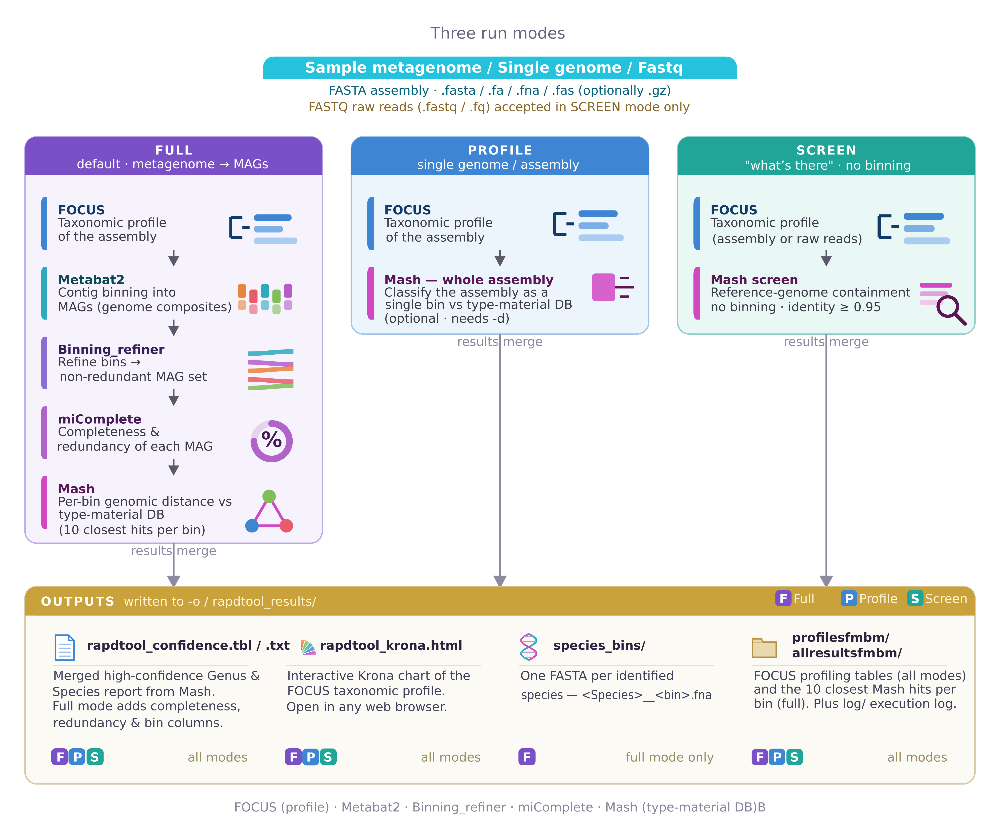

<div align="center">
  <h1>RaPDTool</h1>
  $\huge \textcolor{red}{\textsf{R}}\textsf{a}\textcolor{red}{\textsf{P}}\textcolor{red}{\textsf{D}}\textcolor{red}{\textsf{T}}\textsf{ool}$
  <h1>${{\color{red}Ra}pid\ {\color{red}P}rofiling\ and\ {\color{red}D}econvolution\ {\color{red}Tool}}\ for\ metagenomes$</h1>
</div>



RaPDTool offers a simple, easy-to-use workflow for microbial-community profiling,
contig binning and "genomic-distance" exploration by chaining several
bioinformatic tools into a single pipeline:

1. **Taxonomic profile** from a metagenome assembly (or genomic assembly) with **FOCUS**.
2. **Binning** of a metagenome into individual genomes/bins with **Metabat2**, refined
   into a non-redundant set with **Binning_refiner**.
3. **Completeness / redundancy** and basic MAG statistics with **miComplete**.
4. **"Taxonomic neighborhood"** of each bin against a curated type-material **Mash** database.
5. **Interactive visualization** with **Krona**, plus per-species FASTA output.

---

## What's new

- **Screen mode (v2.3.0)** – `-m screen` runs FOCUS + `mash screen` to report which
  reference genomes are present in a metagenome **without binning** (fast "what's there"),
  accepting either a FASTA assembly or **raw FASTQ reads**.
- **One-line conda install** – `conda create -n rapdtool -c conda-forge -c kjestradag rapdtool`
  sets everything up; the tested image and databases are fetched and cached automatically on first use.
- **Robust error handling** – if any tool fails, the pipeline stops immediately with a
  clear message instead of producing partial/garbage output.
- **External databases** – the mash reference via `-d`/`$RTMASHDB` and the FOCUS k-mer
  database via `--focus-db`/`$RTFOCUSDB` (neither is bundled in the image, keeping it slim).
- **Three run modes** – `full` (default: binning + per-bin classification), `profile`
  (single-genome assembly: FOCUS + whole-assembly Mash), and `screen` (FOCUS +
  `mash screen` containment to report what's present in a metagenome, no binning;
  accepts FASTA or raw FASTQ reads).
- **Parallelism** – `-t/--threads` is passed to FOCUS, Metabat2, miComplete and Mash.
- **Any FASTA extension** accepted (`.fasta`, `.fa`, `.fna`, `.fas`, …, optionally `.gz`)
  with a quick format check.
- **Metabat coverage** – pass a depth/coverage file with `-a`.
- **Per-species bins** – `rapdtool_split_bins.py` writes one FASTA per identified species
  (runs automatically in full mode; disable with `--no-split-bins`).
- Migrated from `os.system` string calls to `subprocess` with argument lists (no shell
  quoting/injection issues); general clean-up and bug fixes.

---

## Install

RaPDTool installs from conda and runs a **prebuilt, tested Apptainer image** — no
bioinformatics tools are installed on your machine. Install it into a dedicated
environment:

```bash
conda create -n rapdtool -c conda-forge -c kjestradag rapdtool
conda activate rapdtool
```

This pulls in [Apptainer](https://apptainer.org/) (from conda-forge) and the `rapdtool`
launcher. On the
**first run**, the image (~0.5 GB) and the reference databases are downloaded and cached
under `~/.cache/rapdtool` (override with `$RAPDTOOL_CACHE`). Each run checks figshare and
re-downloads an asset when a newer version is published (skip with
`$RAPDTOOL_NO_UPDATE_CHECK=1`; force with `rapdtool update`). Pre-fetch everything with:

```bash
rapdtool setup      # optional: download image + databases ahead of time
rapdtool --where    # show where the image and databases are cached
```

Requirements: Linux with conda. That's it — Apptainer and the databases are handled
for you.

<details>
<summary>Advanced: build the image yourself / use your own databases</summary>

```bash
# Build the image from the recipe instead of downloading it
apptainer build --fakeroot rapdtool.sif Singularity.def
export RAPDTOOL_SIF=$PWD/rapdtool.sif

# Point at your own databases instead of the auto-downloaded ones
export RTMASHDB=/path/to/mash_db.msh       # NCBI type material or GTDB r202
export RTFOCUSDB=/path/to/focus            # a directory containing db/k6
```

The image and databases are hosted on figshare and fetched automatically:
[image](https://doi.org/10.6084/m9.figshare.21375609) ·
[mash DB](https://doi.org/10.6084/m9.figshare.21379491) ·
[FOCUS DB](https://doi.org/10.6084/m9.figshare.21395619).
To use a different mash database, set `$RTMASHDB` to any `.msh` (e.g. GTDB r202).
</details>

---

## Usage

The `rapdtool` command forwards its arguments to the pipeline (the databases are provided
automatically):

```
rapdtool -i INPUT [-o OUTPUT] [-m {full,profile,screen}] [-t THREADS] [-a COVERAGE]
         [--screen-identity F] [--no-split-bins] [--force] [-c COMMENT]

  -i, --input      input FASTA assembly (.fasta/.fa/.fna/.fas, optionally .gz)   [required]
                   (screen mode also accepts FASTQ reads: .fastq/.fq[.gz])
  -o, --output     output directory (default: ./rapdtool_results)
  -m, --mode       full (default): binning + per-bin taxonomic classification (MAGs);
                   profile: single-genome assembly (FOCUS + whole-assembly Mash);
                   screen: FOCUS + mash-screen containment — which reference genomes
                   are present in a metagenome (FASTA or raw FASTQ reads), no binning
  -t, --threads    threads for FOCUS/Metabat/miComplete/Mash (default: all cores)
  -a, --coverage   depth/coverage file passed to Metabat2 (-a)
      --screen-identity  min mash-screen identity in screen mode (default: 0.95)
      --no-split-bins   disable per-species FASTA output
      --force      overwrite existing results for the same input
  -c, --comment    comment recorded in the log

  -d, --database   mash .msh to use instead of the cached one   (optional override)
      --focus-db   FOCUS db directory (containing db/k6) to use  (optional override)
```

### Examples

```bash
# Full pipeline (metagenome assembly)
rapdtool -i assembly.fasta -o results

# Screen: which reference genomes are present in a metagenome (no binning)
rapdtool -i assembly.fasta -m screen -o screen_out

# Profile a single-genome assembly (FOCUS + whole-assembly Mash classification)
rapdtool -i genome.fna -m profile -o prof_out

# Full pipeline with 16 threads and a precomputed coverage file
rapdtool -i assembly.fa -t 16 -a depth.txt
```

---

## Output

Results are written under the `-o` directory (default `rapdtool_results`):

- `profilesfmbm/` – FOCUS profiling results
- `allresultsfmbm/` – ten closest Mash hits per bin
- `workfmbm/` – intermediate binning / distance data
- `species_bins/` – one FASTA per identified species (full mode)
- `rapdtool_confidence.tbl` / `.txt` – merged high-confidence Species/Genus report
- `rapdtool_krona.html` – interactive Krona visualization
- `log/logfmbm.txt` – full execution log

For each bin, RaPDTool reports the ten closest neighbors from the Mash comparison,
simplifying interpretation and providing a basis for finer OGRI/ANI analysis.

---

## Repository layout

```
bin/            pipeline scripts (rapdtool.py, rapdtool_split_bins.py, rapdtool_results.pl)
scripts/        rapdtool — host launcher (downloads/caches the image + databases, runs it)
conda-recipe/   conda package recipe (meta.yaml, build.sh)
docs/           figures
Singularity.def container build recipe
CHANGELOG.md    version history
```

See [CHANGELOG.md](CHANGELOG.md) for the full list of changes.

---

## Dependencies

FOCUS · Metabat2 (2.15) · Binning_refiner (1.4.3) · miComplete (1.1.1) · Mash (2.3) ·
KronaTools · entrez-direct (used only when reporting Mash hits; requires internet).

## References

- Sánchez-Reyes, A.; Fernández-López, M.G. *Mash Sketched Reference Dataset for
  Genome-Based Taxonomy and Comparative Genomics*. Preprints 2021, 2021060368.
- Ondov BD *et al.* *Mash: fast genome and metagenome distance estimation using MinHash.*
  Genome Biol. 2016;17(1):132.
- Silva GGZ *et al.* *FOCUS: an alignment-free model to identify organisms in
  metagenomes using non-negative least squares.* PeerJ. 2014;2:e425.
- Song WZ, Thomas T. *Binning_refiner.* Bioinformatics. 2017;33(12):1873-1875.
- Kang DD *et al.* *MetaBAT 2.* PeerJ. 2019;7:e7359.

## Maintainer

RaPDTool was co-developed by **Dr. Ayixon Sánchez-Reyes** and **Dr. Karel Estrada** and is maintained by **Dr. Estrada**.  
**Dr. Karel Estrada** ([@kjestradag](https://github.com/kjestradag) , karel.estrada@ibt.unam.mx) Unidad de Secuenciación Masiva y Bioinformática. UNAM.  
**Dr. Ayixon Sánchez-Reyes** (ayixon@gmail.com , ayixon.sanchez@ibt.unam.mx) Researchers for Mexico Program (CONACYT), Institute of Biotechnology, UNAM.  
Issues and pull requests are welcome on the [GitHub repository](https://github.com/kjestradag/RaPDTool).

## Acknowledgments

We thank Dra. Luz Bretón Deval, Dr. Maikel G. Fernández-López and Ing. Roberto Peredo for his help in developing this tool.  
Funded in part by project CF 2019 265222 (FORDECYT-PRONACES CONACYT-México).
